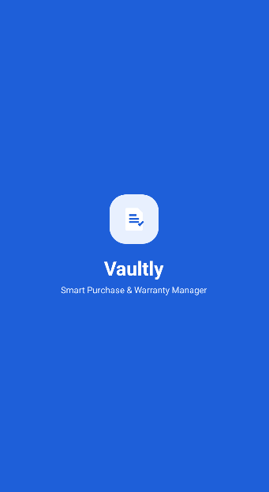
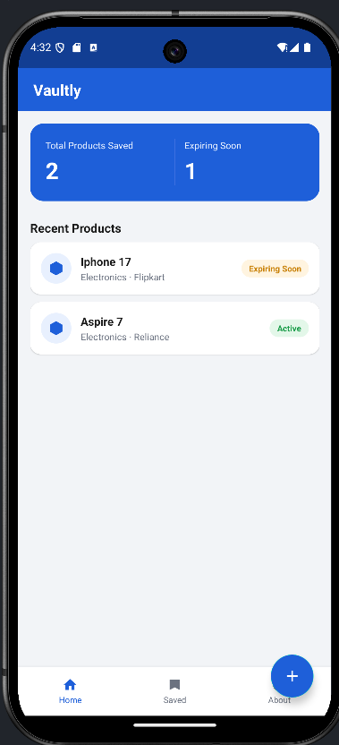
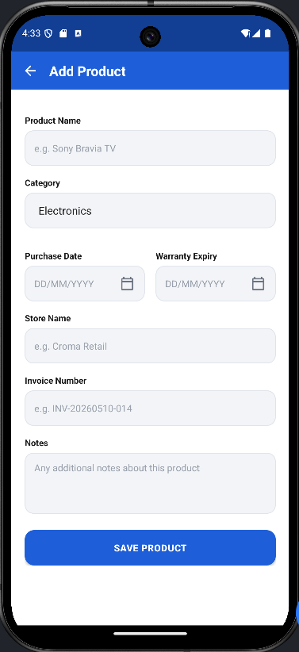
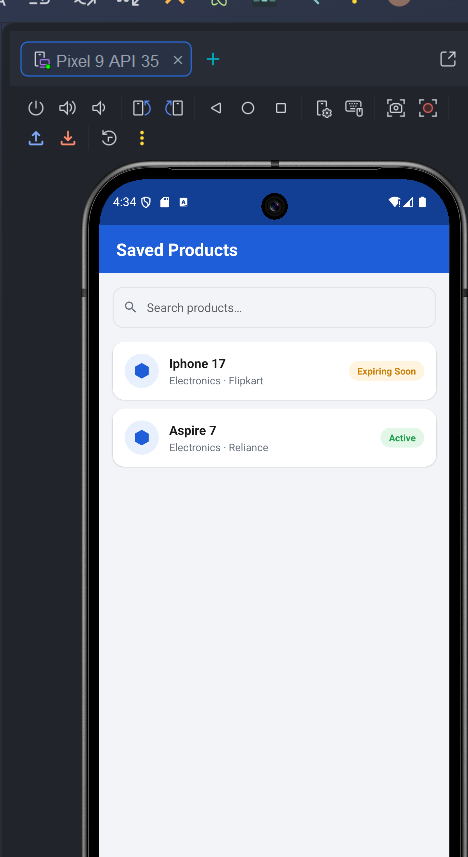
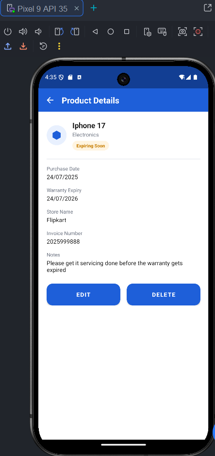
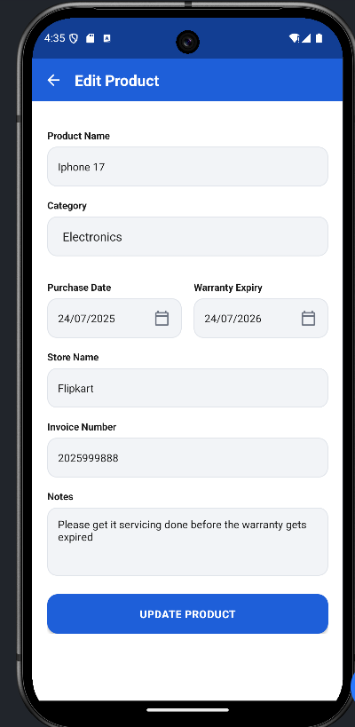
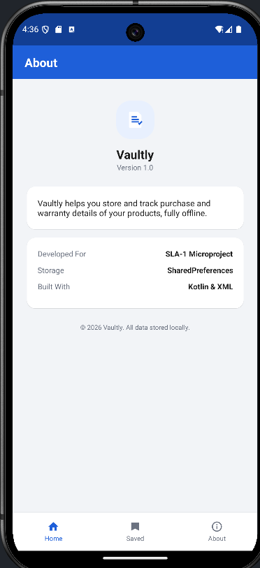
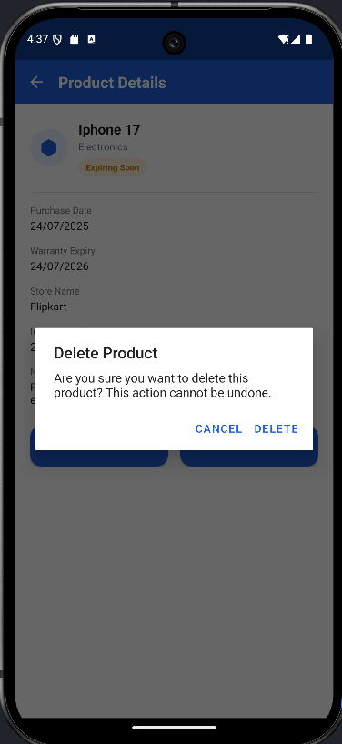

# 🛡️ Vaultly

<p align="center">
  
</p>

<h3 align="center">Smart Purchase & Warranty Manager</h3>

<p align="center">
Store, manage and track product warranty details completely offline.
</p>

---

## 📖 Overview

**Vaultly** is an Android application developed as a **college SLA-1 microproject**. It allows users to securely store purchase and warranty details of their products, making it easy to keep track of warranties without maintaining physical invoices.

The application works completely **offline** using **SharedPreferences**, providing a lightweight and simple solution for managing warranty information.

---

## ✨ Features

- 📦 Add new products
- 📝 Edit product details
- 🗑 Delete products
- 🔍 Search saved products
- 📋 View complete product information
- ⏳ Automatic warranty status detection
- 📊 Dashboard with summary statistics
- 📱 Clean Material UI
- 💾 Offline local storage

---

## 📱 Screens

### 🏠 Home Screen
- Displays total products saved
- Shows products with warranties expiring soon
- Displays recently added products
- Floating Action Button to add a new product

---

### ➕ Add Product
Users can save:

- Product Name
- Category
- Purchase Date
- Warranty Expiry Date
- Store Name
- Invoice Number
- Notes

---

### 📂 Saved Products
- Displays all stored products
- Search products instantly
- Shows warranty status
- Open product details with a single tap

---

### 📄 Product Details
Displays complete information including:

- Product Name
- Category
- Purchase Date
- Warranty Expiry
- Store Name
- Invoice Number
- Notes
- Warranty Status

Users can also:

- Edit Product
- Delete Product

---

### ✏️ Edit Product
Allows users to modify previously saved product details.

---

### ℹ️ About
Displays application information including:

- Version
- Storage Method
- Technologies Used
- Project Information

---

## ⚙️ Warranty Status Logic

Vaultly automatically calculates warranty status based on today's date.

| Remaining Days | Status |
|----------------|--------|
| Less than 0 | ❌ Expired |
| 0–30 Days | 🟠 Expiring Soon |
| More than 30 Days | 🟢 Active |

---

## 🏗 Project Structure

```
Vaultly
│
├── app
│   ├── src
│   │   ├── main
│   │   │
│   │   ├── java/com/example/vaultly
│   │   │      │
│   │   │      ├── SplashActivity.kt
│   │   │      ├── HomeActivity.kt
│   │   │      ├── AddProductActivity.kt
│   │   │      ├── SavedProductsActivity.kt
│   │   │      ├── ProductDetailsActivity.kt
│   │   │      ├── EditProductActivity.kt
│   │   │      ├── AboutActivity.kt
│   │   │      ├── Product.kt
│   │   │      ├── ProductAdapter.kt
│   │   │      └── PrefsManager.kt
│   │   │
│   │   └── res
│   │       ├── layout
│   │       ├── drawable
│   │       ├── values
│   │       └── mipmap
│   │
│   └── build.gradle
│
└── README.md
```

---

## 🛠 Built With

- Kotlin
- XML
- Android Studio
- SharedPreferences
- RecyclerView
- Material Components
- DatePickerDialog

---

## 💾 Data Storage

Vaultly stores all product information locally using **SharedPreferences**.

The product list is serialized into JSON before saving and deserialized back into Kotlin objects when the app starts.

No internet connection or external database is required.

---

## 🚀 Getting Started

### Clone the Repository

```bash
git clone https://github.com/your-username/Vaultly.git
```

### Open the Project

1. Open Android Studio.
2. Select **Open Existing Project**.
3. Choose the cloned Vaultly folder.
4. Wait for Gradle Sync.
5. Run the application.

---

## 📸 Application Screenshots

Create a folder named **screenshots** in the repository and place the screenshots inside it.

Example:

```
screenshots/
│
├── splash.png
├── home.png
├── add_product.png
├── saved_products.png
├── product_details.png
├── edit_product.png
├── about.png
└── delete_dialog.png
```

Then display them like this:

| Splash | Home |
|--------|------|
|  |  |

| Add Product | Saved Products |
|-------------|----------------|
|  |  |

| Product Details | Edit Product |
|-----------------|--------------|
|  |  |

| About | Delete Confirmation |
|--------|---------------------|
|  |  |

---

## 📌 Future Improvements

- 🔔 Warranty expiry notifications
- ☁️ Cloud backup
- 📷 Invoice image attachment
- 📤 Export data to PDF
- 🌙 Dark Mode
- 🏷 Product categories with icons

---

## 👨‍💻 Developer

**Amaan Ali**

B.Tech Computer Science Engineering

Android Development Enthusiast

---

## 📄 License

This project was developed for educational purposes as part of an **SLA-1 Android Microproject**.

Feel free to use and modify it for learning purposes.

---

⭐ If you found this project useful, consider giving it a star on GitHub!
